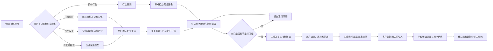
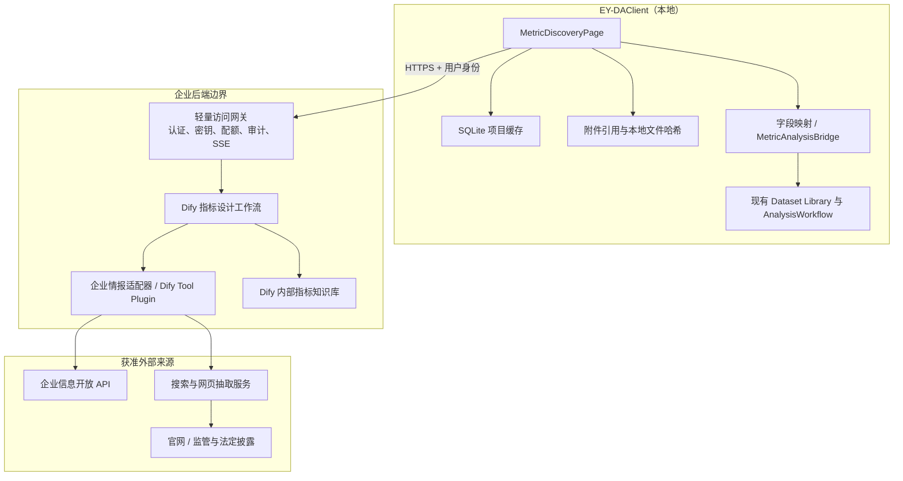
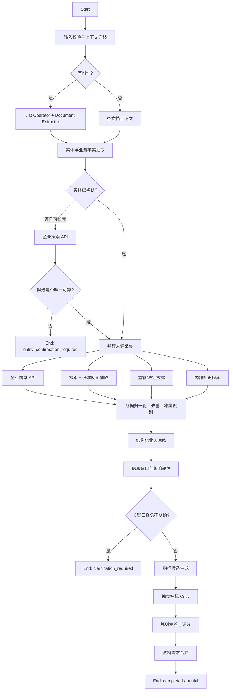

# 指标生成功能：产品需求与架构开发方案

> 文档版本：1.0  
> 编制日期：2026-07-25  
> 适用项目：EY-DAClient  
> 状态：建议方案，供产品评审、架构评审与研发拆分使用

## 1. 执行摘要

本功能建议命名为“指标设计（Metric Discovery）”，定位为现有“数据分析”之前的独立业务域：

1. 通过客户资料、企业公开信息、内部方法论知识库和结构化访谈理解项目公司。
2. 生成有事实依据、可解释、可编辑、可追溯的数据核查指标。
3. 自动形成与指标对应的资料清单、底表字段清单和口径说明。
4. 客户数据到达后，将已选择的指标映射到实际数据集，再交给现有数据分析工作流生成并执行分析代码。

核心架构决策如下：

- 桌面端负责交互、项目本地状态、用户确认、结果编辑、资料引用和数据集映射。
- Dify 负责文档理解、外部信息编排、知识检索、业务画像、指标生成和指标复核。
- 企业信息 API、网页搜索/抽取和全部第三方密钥只在服务端使用，不在桌面端实现爬虫或固化密钥。
- 新功能使用独立的 Dify 工作流和独立的数据契约，不修改现有分析工作流的 `task_type / context / query` 三字段契约。
- “没有客户文件”是正常路径；“连公司名称、统一社会信用代码、网址、行业或业务描述都没有”时，不允许声称生成了针对某公司的指标，只能进入引导式访谈或通用行业模板。
- 每一项指标必须同时包含业务依据、计算口径、所需字段、适用条件、证据、置信度和数据可得性，不输出只有名称的“灵感清单”。
- 生产环境应在桌面端与 Dify 之间设置一个轻量访问网关。Dify 官方文档明确建议 App API Key 只从后端调用，不应嵌入前端或客户端。

## 2. 背景与问题定义

### 2.1 现有业务流程

完整的数据核查项目通常包含：

1. 理解项目公司业务、工作内容、商业模式、主要风险和管理关注点。
2. 基于理解结果设计财务、销售、采购、运营等数据核查指标，并向客户索取相关资料、数据集和底表。
3. 对取得的数据进行核查分析并形成报告。

EY-DAClient 目前主要覆盖第 3 步：

- 导入一个或多个 Excel 数据集；
- 本地完成数据画像和 Parquet 缓存；
- 向 Dify 发送紧凑的数据结构上下文；
- Dify 生成分析计划和 Python；
- 本地校验、样本预检、用户确认并执行完整数据；
- 通过结构化结果协议展示分析结果。

新功能需要补齐第 1 步，并为第 2 步形成可直接使用的交付物。

### 2.2 当前痛点

- 客户前期资料可能丰富，也可能只有一个公司名称，甚至暂时没有任何文件。
- 项目团队对新行业的了解速度和深度不一致。
- 指标设计容易停留在通用模板，缺少对商业模式和项目风险的针对性。
- 指标、数据需求和后续分析任务之间缺少稳定映射，客户资料到达后需要重复理解。
- AI 自动研究容易发生实体匹配错误、来源不可靠、结论过时或“看似合理但不可计算”。
- 若把网页爬取、模型调用和文档解析都放到桌面端，会增加安装包体积、维护成本、密钥泄露面和网络不稳定性。

## 3. 产品目标、非目标与原则

### 3.1 产品目标

| 编号 | 目标 | 衡量方式 |
|---|---|---|
| G1 | 在没有客户文件时也能启动公司研究 | 仅输入公司名称或统一社会信用代码即可形成待确认的企业画像 |
| G2 | 生成针对性且可执行的指标 | 入选指标 100% 具备公式、粒度、维度、数据字段和适用条件 |
| G3 | 保证事实可追溯 | 公司特定事实和公司特定指标均显示来源、获取日期和证据等级 |
| G4 | 自动形成资料索取清单 | 每个已选指标均能追溯到一项或多项数据需求 |
| G5 | 与现有分析链路打通 | 客户数据导入后，可确认字段映射并进入现有分析工作流 |
| G6 | 保持客户端精简 | 联网检索、第三方 API、长文档理解和指标推理由后端完成 |
| G7 | 人在回路 | 企业实体、关键业务假设、指标选择和字段映射均由用户确认 |

### 3.2 非目标

首版不包含：

- 自动替代项目经理或行业专家作最终专业判断；
- 自动生成最终数据核查报告全文；
- 在没有任何企业或行业线索时生成“公司定制”指标；
- 在桌面端实现通用网页爬虫、浏览器自动化或第三方企业信息 SDK；
- 未经用户确认直接向客户发送邮件或资料清单；
- 未经用户确认直接执行数据核查；
- 将客户项目资料自动写入全局共享知识库；
- 将原始业务底表上传到 Dify。现有“原始数据本地执行”的原则保持不变。

### 3.3 设计原则

1. **事实与推断分离**：公开事实、客户陈述、行业模板和 AI 推断必须有不同标签。
2. **先实体确认，后深入研究**：同名公司、集团与子公司不得自动混用。
3. **先业务问题，后计算公式**：指标必须解释其要验证的业务假设或风险。
4. **先可行性，后数量**：优先输出少量高价值、数据可获得的指标。
5. **证据不足即提问**：不得用模型常识伪装成公司事实。
6. **接口优先于爬取**：优先使用授权 API、官方数据服务和被允许的搜索/抽取服务。
7. **客户端无第三方密钥**：第三方企业数据、搜索和抽取服务的密钥只存放在后端。
8. **契约隔离**：指标设计契约与分析执行契约分离，通过受控适配器衔接。
9. **部分失败可用**：某一公开来源失败时，允许用其他来源和访谈继续，而不是整次任务失败。
10. **版本可复现**：保存来源时间、工作流版本、知识库版本和用户修改记录。

## 4. 用户、场景与术语

### 4.1 主要用户

- 项目经理：确定研究范围、确认公司主体、审核指标和资料清单。
- 数据分析人员：补充业务理解、评估数据可得性、完成字段映射并发起分析。
- 行业专家：维护行业指标模板和审核高风险指标。
- 系统管理员：配置 Dify、企业信息供应商、搜索服务、访问策略和配额。

### 4.2 核心场景

| 场景 | 初始输入 | 系统行为 |
|---|---|---|
| A. 资料充分 | 公司名称 + 多份业务资料 | 解析资料、补充公开信息、生成业务画像和指标 |
| B. 无文件 | 公司名称/信用代码/官网 | 通过公开信息和内部知识库研究，必要时提出缺口问题 |
| C. 信息很少 | 行业 + 一句话业务描述 | 生成标明“行业假设”的初稿，并通过访谈逐步定制 |
| D. 完全空白 | 无文件、无公司、无行业 | 不生成定制指标；引导输入公司标识或选择行业访谈 |
| E. 同名企业 | 模糊公司名称 | 展示候选主体，要求用户确认后再研究 |
| F. 公开信息稀缺 | 小型非上市公司 | 以工商信息、官网和结构化访谈为主，降低置信度 |
| G. 数据已到达 | 已选指标 + Excel 底表 | 识别字段候选、用户确认映射、进入现有分析工作流 |

### 4.3 术语

- **指标项目**：一次针对特定公司或行业范围的指标设计工作空间。
- **业务画像**：带证据的公司身份、业务模式、客户、渠道、收入、运营流程和风险摘要。
- **指标包**：经过版本化的一组指标定义、证据、优先级和数据需求。
- **数据需求**：为计算或核查某项指标需要的表、字段、粒度、期间和口径。
- **证据**：支持业务事实或指标理由的来源记录。
- **移交**：将指标包中的指标映射到实际数据集并送入现有分析链路。

## 5. 信息获取策略

### 5.1 四层来源模型

按优先级组合以下来源，而不是依赖单一“AI 联网搜索”：

| 层级 | 来源 | 适用信息 | 建议实现 |
|---|---|---|---|
| L1 | 客户资料与用户访谈 | 实际流程、系统、口径、定价、渠道、例外规则 | Dify 文件输入、文档抽取、结构化问答 |
| L2 | 授权结构化企业信息 API | 工商主体、行业、经营范围、股东、分支机构、风险、产品等 | 企查查/天眼查等开放平台，经后端适配器调用 |
| L3 | 官方及公开网页 | 官网、监管披露、年报、招股书、交易所公告、监管许可 | 搜索 API + 合规网页抽取；上市公司优先法定披露平台 |
| L4 | 内部知识库 | 行业风险、标准指标、历史匿名经验、资料清单模板 | Dify Knowledge Retrieval |

来源之间不相互替代：

- L2 适合精确实体和结构化字段，但不能完整说明实际商业模式。
- L3 能提供产品、客户、战略和经营变化，但需要时间和来源质量判断。
- L4 能提供方法论，但不能当作该公司的事实。
- L1 最接近实际情况，但仍需区分“客户陈述”和“外部核验结果”。

### 5.2 公开信息渠道建议

#### 5.2.1 企业主体与工商信息

推荐顺序：

1. 使用有合同和程序化授权的企业信息开放平台作为主要 API。
2. 使用国家企业信用信息公示系统作为权威核验入口或人工复核源。
3. 不把公示系统网页、企查查网页或天眼查网页当作无授权爬虫目标。

企查查开放平台和天眼查开放平台均提供企业搜索、基本工商信息及其他企业维度的 API。供应商选型需要比较：

- 企业搜索和主体唯一标识能力；
- 工商、产品、知识产权、司法/经营风险的覆盖；
- 数据更新时间与来源说明；
- 单次、余额或企业户计费方式；
- 并发、限流、缓存和二次展示条款；
- 是否允许在本项目交付物中展示摘要；
- 数据出境、保留和审计要求。

#### 5.2.2 上市公司与发债主体

优先使用：

- 巨潮资讯、上交所、深交所、北交所等法定或官方披露平台；
- 公司投资者关系官网；
- 年报、招股说明书、公告和监管问询回复。

公开新闻只能作为补充线索，不应覆盖更新、更权威的监管披露。

#### 5.2.3 公司官网与一般网页

采用服务端的“搜索—筛选—抽取”链路：

1. 搜索 API 返回候选 URL 和摘要。
2. 域名策略过滤，只允许 `http/https`、公共 IP 和获准域名。
3. 抽取服务获取正文、标题、发布时间和最终 URL。
4. 对内容去重、限长、哈希并抽取事实。
5. 保存短证据片段和来源元数据，不在本地长期复制整站内容。

严禁：

- 桌面端绕过验证码或登录；
- 高频扫描和深度遍历整站；
- 忽略 robots、服务条款或版权限制；
- 访问内网地址、云元数据地址或任意用户提供的 URL；
- 将抓取到的个人联系方式等与指标目的无关的信息纳入模型上下文。

### 5.3 “无资料”与“零输入”的处理

“无资料”不是“无标识”：

- 若用户提供公司名称、信用代码或官网，系统可以自动研究。
- 若只知道行业或业务类型，系统可生成行业假设型指标，并明确要求后续确认。
- 若没有公司、行业、业务描述和文件，系统没有足够信息生成针对性指标。

完全空白时，界面只提供两个合理入口：

1. “查找一家企业”：要求至少输入公司名称、统一社会信用代码或官网。
2. “从行业访谈开始”：先选择行业，再回答最少量的业务问题。

首轮访谈建议覆盖：

- 销售什么产品或服务；
- 主要客户与获客渠道；
- 合同、订单、交付、开票和收款链路；
- 价格、折扣、返利和退货规则；
- 采购、库存或履约模式；
- 主要系统和可取得的数据表；
- 管理层最关注的异常、风险或增长问题。

每次只问 1 个主题、最多 3 个紧密相关问题，避免一次展示长问卷。

## 6. 端到端产品流程



### 6.1 桌面端信息架构

现有 `ui/main_window.py` 已预留并禁用了 `Metrics (coming soon)` 导航项。建议将其启用并增加独立 `MetricDiscoveryPage`，不要把完整功能继续堆入 `MainWindow`。

页面结构：

1. **项目设置**
   - 公司名称/信用代码/官网；
   - 行业、地区、项目范围；
   - 可选文件；
   - 是否允许公开信息检索；
   - 数据敏感级别与上传提示。
2. **企业理解**
   - 已确认主体；
   - 业务画像；
   - 来源与证据；
   - 冲突和未知项；
   - 待回答问题。
3. **指标工作台**
   - 指标列表或紧凑卡片；
   - 财务、销售、采购、运营等筛选；
   - 相关性、风险、数据可得性和置信度；
   - 公式、粒度、维度、证据和数据需求；
   - 选择、编辑、合并、拒绝和补充生成。
4. **资料清单**
   - 按业务负责人、系统或底表分组；
   - 必需/可选字段；
   - 期间、粒度、主键/关联键和格式要求；
   - 可导出为 Excel，后续可扩展 Word/PDF。
5. **数据移交**
   - 关联 Dataset Library 中的实际文件；
   - 字段候选和匹配置信度；
   - 用户确认；
   - 发起分析。

### 6.2 初始页改造

现有初始页以数据导入为第一入口，且只有数据准备完成后才显示分析/清洗能力。指标设计必须支持无数据启动，因此建议：

- 保留现有数据导入主入口；
- 在初始页增加轻量次入口：“还没有数据？先设计核查指标”；
- 指标设计入口始终可用；
- “数据分析”和“数据清洗”仍需至少一个已就绪数据集；
- 进入任一功能后，标题栏 `Mode` 增加 `Metric Design`；
- Dataset Library 不属于指标项目附件库，避免把业务资料误当作待分析底表。

### 6.3 企业实体确认

用户输入公司名称后：

1. 后端返回最多 5 个候选主体；
2. 每个候选展示法定名称、信用代码后四位、状态、地区、成立时间和官网；
3. 用户必须选择一个，或选择“都不是/仅做行业研究”；
4. 保存供应商主体 ID、统一社会信用代码和用户确认时间；
5. 集团、母公司、子公司必须作为不同主体处理，可由用户显式增加研究范围。

### 6.4 研究进度与失败交互

研究任务通常需要几十秒，不应显示无反馈的阻塞弹窗。建议使用阶段式进度：

- 正在确认企业主体；
- 正在解析项目资料；
- 正在读取公开信息；
- 正在构建业务画像；
- 正在生成和校验指标；
- 已完成，部分来源不可用。

用户可以取消。单个来源失败时显示非模态警告和已完成结果，例如：

> 企业工商信息已取得；公司官网暂时不可访问，本次指标主要依据客户资料和行业知识库。

不得将后端堆栈、密钥错误或供应商响应正文直接显示给普通用户。

## 7. 功能需求

### 7.1 需求优先级

- P0：首个可用版本必须具备。
- P1：完成稳定移交和生产试点所需。
- P2：规模化、协作和持续学习能力。

### 7.2 详细功能需求

| 编号 | 优先级 | 需求 | 验收标准 |
|---|---:|---|---|
| FR-01 | P0 | 创建指标项目 | 可在无数据集时创建；生成稳定 `project_id`；保存草稿 |
| FR-02 | P0 | 多种输入 | 支持公司标识、业务描述和可选附件；所有字段均可后补 |
| FR-03 | P0 | 零输入保护 | 无公司/行业/资料时不调用指标生成，只显示两种引导入口 |
| FR-04 | P0 | 企业候选匹配 | 同名候选必须由用户确认；未确认前不生成公司特定事实 |
| FR-05 | P0 | 客户资料理解 | 支持 PDF、DOCX、PPTX、XLSX、CSV、TXT 等获准格式；显示上传范围和状态 |
| FR-06 | P0 | 公开信息研究 | 至少支持一种授权企业信息 API 和一种获准网页搜索/抽取方式 |
| FR-07 | P0 | 业务画像 | 输出身份、行业、产品/服务、客户、渠道、收入模式、履约流程、地域、风险和未知项 |
| FR-08 | P0 | 证据追溯 | 每个公司特定事实至少关联一条证据；证据含来源、URL/文档名、获取时间和等级 |
| FR-09 | P0 | 冲突处理 | 不同来源冲突时不自动覆盖，显示冲突并要求确认或按权威性标记 |
| FR-10 | P0 | 缺口访谈 | 仅询问会显著改变指标或数据需求的问题；支持回答后继续同一项目 |
| FR-11 | P0 | 指标候选生成 | 每项指标满足 `MetricDefinition` 契约；默认输出 8–15 项，不追求数量 |
| FR-12 | P0 | 指标复核 | 后端检查公式完整性、维度/粒度、数据字段、证据、适用条件、除零和空值规则 |
| FR-13 | P0 | 指标工作台 | 可查看、筛选、选择、编辑、拒绝、恢复、排序；用户编辑不被刷新覆盖 |
| FR-14 | P0 | 数据可得性 | 每项指标标记 `ready / partial / unknown / unavailable`，不能把未知标成可计算 |
| FR-15 | P0 | 资料清单生成 | 已选指标 100% 映射到数据表/字段需求；相同需求自动合并但保留反向关联 |
| FR-16 | P0 | 导出 | 至少导出指标包 JSON 和资料清单 XLSX；导出内容含版本和生成时间 |
| FR-17 | P0 | 本地项目保存 | 关闭应用后可恢复画像、指标、资料清单、用户决定和运行状态 |
| FR-18 | P0 | 取消与重试 | 用户可取消运行；可从失败阶段重试；重复请求不产生重复项目版本 |
| FR-19 | P1 | 数据集字段匹配 | 对已导入 Dataset Library 的数据生成字段候选，不自动确认低置信度匹配 |
| FR-20 | P1 | 指标移交 | 只有所需字段映射完成的指标可发送到现有分析链路 |
| FR-21 | P1 | 版本比较 | 可比较两个指标包版本，显示新增、删除、口径变化和证据变化 |
| FR-22 | P1 | 来源策略配置 | 管理员可启停供应商、设置域名允许列表、配额、超时、缓存和保留期限 |
| FR-23 | P1 | 审计记录 | 记录用户确认、用户修改、来源调用、工作流版本和移交动作 |
| FR-24 | P1 | 部分结果恢复 | 工作流中断后，可恢复已取得的来源结果而非全部重新调用 |
| FR-25 | P2 | 协作审阅 | 支持项目经理/行业专家评论、批准和锁定指标包 |
| FR-26 | P2 | 经验学习 | 只将经批准且脱敏的方法论写入共享知识库，禁止写入项目原文和客户数据 |
| FR-27 | P2 | 指标模板治理 | 行业专家可发布、停用和版本化标准指标模板 |

## 8. 指标质量模型

### 8.1 指标最低完整性

每项指标至少包含：

- 指标名称和类别；
- 要验证的业务问题或风险；
- 与该公司的关联理由；
- 公式或核查逻辑；
- 结果粒度和分析维度；
- 时间窗口；
- 分子、分母、空值、异常值和除零规则；
- 所需表、字段和关联键；
- 适用条件和不适用条件；
- 来源证据；
- 相关性、风险覆盖、可执行性、数据可得性和证据置信度；
- 优先级；
- 状态和用户决定。

### 8.2 建议评分

总分用于排序，不代替专业判断：

| 维度 | 权重 | 含义 |
|---|---:|---|
| 业务相关性 | 30 | 是否直接对应已确认的商业模式或项目目标 |
| 风险覆盖 | 25 | 是否能发现重大错报、异常或经营风险 |
| 数据可得性 | 20 | 客户是否可能提供计算所需数据 |
| 可行动性 | 15 | 结果是否能支持调查、整改或报告结论 |
| 证据置信度 | 10 | 公司特定依据的权威性、时效性和一致性 |

建议优先级：

- A：总分不低于 80，且数据可得性不低于 `partial`；
- B：总分 60–79；
- C：总分低于 60，或高度依赖未确认假设；
- Hold：公式或关键字段尚不明确。

### 8.3 证据等级

| 等级 | 来源 | 使用规则 |
|---|---|---|
| E1 | 法定披露、监管来源、客户正式制度/合同 | 可支撑高置信事实，但仍记录日期和范围 |
| E2 | 授权结构化企业 API、经确认的客户访谈 | 可支撑业务画像；客户陈述需标明“客户提供” |
| E3 | 企业官网、产品页、投资者关系材料 | 可支撑企业自述，不自动视为外部验证 |
| E4 | 可信新闻、行业研究 | 用于补充背景和假设 |
| E5 | 内部行业模板或模型推断 | 只能标记为假设，不得显示为该公司事实 |

置信度不由 LLM 自由打分，而由服务端规则根据来源等级、来源数量、时效和冲突情况计算。

## 9. 数据契约

### 9.1 版本策略

- 指标包契约：`metric_pack.v1`
- 项目上下文契约：`metric_project_context.v1`
- 后续字段可新增；已发布字段不得改变含义。
- 本地保存原始后端响应和迁移后的当前对象，便于升级。

### 9.2 BusinessProfile

```json
{
  "schema_version": "business_profile.v1",
  "entity": {
    "legal_name": "示例公司",
    "unified_social_credit_code": "masked-or-full-per-policy",
    "entity_provider_id": "provider-specific-id",
    "status": "active",
    "region": "上海",
    "industry_codes": [
      {"system": "GB/T 4754-2017", "code": "651", "label": "软件开发"}
    ],
    "entity_confirmed_by_user": true
  },
  "business_model": {
    "products_services": [],
    "customer_segments": [],
    "sales_channels": [],
    "revenue_models": [],
    "delivery_process": [],
    "geographies": [],
    "key_systems": []
  },
  "risk_drivers": [],
  "facts": [
    {
      "fact_id": "F001",
      "statement": "公司主要通过……取得收入",
      "fact_type": "company_fact",
      "evidence_ids": ["EV001"],
      "confidence": "medium",
      "as_of_date": "2026-07-25"
    }
  ],
  "unknowns": [],
  "conflicts": []
}
```

### 9.3 Evidence

```json
{
  "evidence_id": "EV001",
  "source_type": "official_disclosure",
  "source_level": "E1",
  "title": "2025 年年度报告",
  "publisher": "示例公司",
  "url": "https://example.com/report",
  "document_name": "",
  "published_at": "2026-03-31",
  "retrieved_at": "2026-07-25T10:30:00+08:00",
  "excerpt": "与当前事实直接相关的短证据片段",
  "content_hash": "sha256:...",
  "supports": ["F001"],
  "status": "active"
}
```

### 9.4 MetricDefinition

```json
{
  "metric_id": "M-SALES-001",
  "name": "大额折扣订单占比",
  "category": "sales",
  "business_question": "是否存在异常折扣导致收入或毛利偏离正常水平？",
  "company_relevance": {
    "rationale": "公司采用经销与直销并行且存在分层折扣政策。",
    "fact_ids": ["F001", "F006"],
    "evidence_ids": ["EV001", "EV009"],
    "basis_type": "company_specific"
  },
  "definition": {
    "formula": "异常折扣订单金额 / 全部订单金额",
    "numerator": "折扣率超过适用政策阈值的订单含税金额之和",
    "denominator": "同期间全部有效订单含税金额之和",
    "grain": "订单行",
    "dimensions": ["月份", "客户", "渠道", "销售人员", "产品"],
    "time_window": "最近 24 个月，按月",
    "null_policy": "折扣或标价为空的订单单列为数据质量异常",
    "zero_division_policy": "分母为 0 的期间不计算并提示",
    "threshold_rule": "阈值优先取客户制度；未取得时不得使用固定行业阈值"
  },
  "data_requirements": [
    {
      "requirement_id": "DR-SALES-001",
      "logical_table": "sales_order_line",
      "grain": "一行一订单明细",
      "required_fields": [
        "order_id",
        "order_date",
        "customer_id",
        "channel",
        "product_id",
        "list_price",
        "actual_price",
        "quantity",
        "order_status"
      ],
      "join_keys": ["order_id", "product_id"],
      "period": "最近 24 个月"
    }
  ],
  "applicability": {
    "conditions": ["存在可追溯的标价或折扣政策"],
    "not_applicable_when": ["所有订单均为完全定制且无可比基准"]
  },
  "scores": {
    "business_relevance": 90,
    "risk_coverage": 85,
    "data_feasibility": 70,
    "actionability": 85,
    "evidence_confidence": 75,
    "total": 83
  },
  "data_readiness": "partial",
  "priority": "A",
  "status": "selected",
  "assumptions": ["客户能够提供标价或折扣政策"],
  "warnings": []
}
```

### 9.5 DataRequest

资料清单必须以逻辑底表为中心合并，而不是每项指标生成一份重复清单：

```json
{
  "request_id": "DR-SALES-001",
  "logical_table": "sales_order_line",
  "business_owner": "销售运营",
  "source_system": "待确认",
  "description": "销售订单明细",
  "grain": "一行一订单明细",
  "period": "最近 24 个月",
  "format": "XLSX/CSV",
  "required_fields": [],
  "optional_fields": [],
  "join_keys": [],
  "related_metric_ids": ["M-SALES-001", "M-SALES-004"],
  "sensitivity": "confidential",
  "notes": "金额字段需说明含税/不含税和币种"
}
```

## 10. 总体架构

### 10.1 推荐生产架构



### 10.2 为什么需要轻量访问网关

Dify 官方 API 指南明确建议从后端调用，嵌入前端或客户端的 API Key 可被提取和滥用。当前项目直接从 PySide6 客户端调用 Dify，适合作为受控试点，但不应为新功能继续扩大客户端密钥面。

网关只承担薄层职责，不承载指标业务逻辑：

- 企业 SSO/JWT 或设备身份认证；
- 将用户身份映射到 Dify `user`；
- 安全保存 Dify App Key 和第三方密钥；
- 请求大小、文件类型、配额和并发控制；
- 生成并校验 `Idempotency-Key`；
- 转发 Dify SSE 进度；
- 统一错误码和审计；
- 可选的短期响应缓存。

业务编排仍在 Dify，客户端仍然精简。

若首期客观上无法部署网关，只能将“桌面端直连内部 Dify”作为限时试点方案：

- 使用独立、最小权限、可轮换的 App Key；
- 密钥存放 Windows Credential Manager/DPAPI，而不是源代码或 `.env.example`；
- 仅连接企业内网 Dify；
- 禁止在客户端保存企业信息和搜索服务密钥；
- 上线前必须迁移到网关。

### 10.3 前后端职责

| 能力 | 本地客户端 | Dify/后端 |
|---|---|---|
| 项目创建、导航和交互 | 是 | 否 |
| 项目草稿、用户决定、本地历史 | 是，SQLite | 可保留运行审计 |
| 附件选择、大小/类型检查、哈希 | 是 | 服务端二次校验 |
| 文档正文解析与 OCR | 否，默认后端 | 是 |
| 企业信息 API、搜索、网页抽取 | 否 | 是 |
| 外部 API 密钥 | 否 | 是 |
| 业务画像、缺口问题、指标生成 | 否 | 是 |
| 指标编辑和选择 | 是 | 可接受增量修改请求 |
| 原始分析底表 | 仅本地 | 不上传 |
| 数据集画像和字段映射候选 | 本地画像；Dify可基于脱敏 schema 建议 | 可生成候选 |
| Python 生成 | 否 | 现有分析 Dify 工作流 |
| Python 校验和执行 | 是 | 否 |

### 10.4 本地模块建议

建议新增：

```text
core/
  metric_models.py             # Pydantic/dataclass 契约与迁移
  metric_project_store.py      # SQLite repository
  metric_analysis_bridge.py    # 指标 -> confirmed_intent
  metric_field_matcher.py      # 本地 schema 候选匹配
dify/
  metric_client.py             # 独立客户端/网关 SSE 客户端
services/
  metric_discovery_service.py  # 用例编排，不含 UI
workers/
  metric_discovery_worker.py   # Qt 后台任务与取消
ui/
  metric_discovery_page.py
  metric_project_setup.py
  business_profile_panel.py
  metric_workbench.py
  data_request_panel.py
  metric_handoff_panel.py
```

改造：

- `ui/main_window.py`：只负责注册新页面、Mode 路由和全局状态；
- `ui/data_portal.py`：增加无数据指标设计次入口；
- `config/settings.py`：只增加网关 URL、超时和功能开关，不增加第三方密钥；
- `config/runtime_paths.py`：增加指标项目数据库和临时附件目录；
- `main.spec`：只增加新本地模块，不增加爬虫或浏览器依赖。

建议使用 Python 标准库 `sqlite3`，避免引入本地数据库服务。附件默认保存原路径引用、大小、mtime 和 SHA-256，不重复复制；若原文件移动，界面提示重新定位。

## 11. Dify 工作流设计

### 11.1 独立工作流

创建独立的“指标设计工作流”，不要在现有分析工作流继续增加 `task_type`。原因：

- 指标设计需要文件列表、企业研究和多轮澄清；
- 现有分析客户端严格验证三个 Start 输入；
- 两类工作流的超时、模型、知识库、错误分支和输出完全不同；
- 独立发布和回滚可以避免影响已验证的数据分析能力。

建议 Start 输入：

| 变量 | 类型 | 必填 | 说明 |
|---|---|---:|---|
| `action` | Select | 是 | `research`、`answer_gap`、`refine_metrics`、`regenerate_request` |
| `project_context_json` | Paragraph | 是 | 项目、已确认实体、已有画像、用户决定和版本 |
| `user_message` | Paragraph | 否 | 本轮要求或问题回答 |
| `attachments` | File List | 否 | 本轮新增客户资料 |

建议 End 输出：

| 变量 | 说明 |
|---|---|
| `schema_version` | `metric_workflow_output.v1` |
| `status` | `entity_confirmation_required / clarification_required / completed / partial / failed` |
| `entity_candidates` | 待确认主体 |
| `business_profile` | 业务画像 JSON |
| `evidence` | 证据数组 JSON |
| `questions` | 最多 3 个缺口问题 |
| `metrics` | 指标数组 JSON |
| `data_requests` | 合并后的资料需求 JSON |
| `warnings` | 来源失败、冲突、过时和置信度警告 |
| `run_meta` | 工作流、模型、知识库和连接器版本 |

### 11.2 工作流节点



### 11.3 工作流关键规则

#### 输入安全

- 文档、网页和企业字段全部视为不可信数据，不得作为系统指令执行。
- 文件需经过扩展名、MIME、大小、页数、压缩比和恶意内容检查。
- 单文件、总文件和抽取文本设置上限；超限时分块或提示用户缩小范围。
- 任意 URL 必须经过服务端允许列表、DNS/IP 校验和重定向限制。

#### 实体解析

- 优先统一社会信用代码，其次法定名称 + 地区，再次官网域名。
- 不以名称字符串相似度单独认定企业。
- 低置信或多候选直接返回用户确认。

#### 事实抽取

- 每条事实必须携带 `evidence_ids`。
- 无证据的内容只能进入 `unknowns` 或 `hypotheses`。
- 记录来源日期；过期信息不得无提示地覆盖新信息。
- 冲突事实交给规则或用户，不由模型静默选择。

#### 指标生成

- 先从业务画像识别价值链、关键交易循环、异常风险和可取得数据。
- 检索内部行业指标库后做适配，不直接复制模板。
- 公司特定指标必须至少关联一个公司事实；通用指标标记 `industry_hypothesis`。
- 不得发明客户系统名、表名、字段名或阈值。
- 阈值来源不足时，将“获取政策/历史分布后确定阈值”写入资料需求。
- 每项指标必须通过结构化输出。

#### 双层质量门

1. **模型 Critic**：检查业务逻辑、重复指标、公司相关性和不合理假设。
2. **确定性规则节点**：检查必填字段、公式、数据需求、证据引用、评分边界、空值/除零规则和 ID 唯一性。

规则未通过时：

- 允许最多 2 次定向修复；
- 仍不通过的指标进入 `rejected_by_validator`，不得展示为已就绪；
- 其他合格指标仍可作为部分结果返回。

### 11.4 Dify 知识库

建议分库：

1. **指标方法论库**
   - 财务、销售、采购、库存、运营等指标定义；
   - 标准数据需求；
   - 常见异常和适用条件。
2. **行业业务与风险库**
   - 行业价值链、收入模式、关键风险和常用系统；
   - 监管要求和专业术语。
3. **已批准经验库**
   - 从成功项目提炼的脱敏方法；
   - 不含客户名称、原始数据、路径、完整代码和结果数值。

每个知识文档至少带以下 metadata：

- `knowledge_type`
- `industry_code`
- `business_cycle`
- `applicable_entity_type`
- `jurisdiction`
- `effective_from / effective_to`
- `source_authority`
- `review_status`
- `version`

项目附件不应默认进入共享知识库。若需要长周期项目检索，可在 P1 建立按项目隔离、带 TTL 的临时知识库，并由服务端管理其生命周期。

### 11.5 外部连接器

推荐以“企业情报适配器”统一不同供应商，向 Dify 暴露稳定工具：

```text
search_entities(query, region?)
get_entity_profile(entity_id)
get_entity_business(entity_id)
get_entity_risks(entity_id, categories?)
search_public_web(query, allowed_domains?, freshness_days?)
extract_public_page(url)
search_official_disclosures(entity, date_range?, document_types?)
```

适配器负责：

- 供应商鉴权和签名；
- 字段归一化；
- 超时、重试、限流和熔断；
- 成本预算和缓存；
- 去除与目的无关的个人信息；
- 记录来源、许可范围和数据时间；
- 将供应商错误映射为稳定错误码。

## 12. 客户端—网关接口

以下是建议的业务接口，网关再映射到 Dify App API。

### 12.1 创建/启动研究

```http
POST /v1/metric-projects/{project_id}/runs
Authorization: Bearer <enterprise-user-token>
Idempotency-Key: <uuid>
Content-Type: multipart/form-data
```

字段：

- `action`
- `project_context_json`
- `user_message`
- `attachments[]`

响应：

```json
{
  "run_id": "run_...",
  "status": "queued",
  "events_url": "/v1/metric-runs/run_.../events"
}
```

### 12.2 进度

使用 SSE：

```text
event: progress
data: {"stage":"public_research","message":"正在读取公开信息","percent":40}

event: partial
data: {"business_profile":{...}}

event: completed
data: {"result":{...}}
```

### 12.3 错误码

| 错误码 | 客户端行为 |
|---|---|
| `ENTITY_CONFIRMATION_REQUIRED` | 展示候选主体，不弹错误框 |
| `CLARIFICATION_REQUIRED` | 展示问题卡片 |
| `SOURCE_PARTIAL_FAILURE` | 保留结果并显示来源警告 |
| `FILE_REJECTED` | 指明文件和可修复原因 |
| `POLICY_BLOCKED` | 说明该来源/文件不允许处理 |
| `RATE_LIMITED` | 显示可重试时间 |
| `WORKFLOW_CONTRACT_INVALID` | 记录详细日志，向用户显示稳定失败摘要 |
| `UNAUTHORIZED` | 重新认证，不暴露 Dify Key |

## 13. 本地存储设计

建议 SQLite 表：

| 表 | 主要内容 |
|---|---|
| `metric_projects` | 项目名称、公司、状态、当前版本、创建/更新时间 |
| `metric_runs` | 后端 run_id、action、阶段、工作流版本、错误摘要 |
| `attachment_refs` | 原路径、文件名、大小、mtime、哈希、上传状态 |
| `business_profiles` | 版本化画像 JSON |
| `evidence_sources` | 来源元数据、短片段、哈希和状态 |
| `metric_definitions` | 指标 JSON、用户状态和版本 |
| `data_requests` | 合并后的资料需求 |
| `metric_data_request_links` | 指标与资料需求多对多关系 |
| `field_mappings` | 逻辑字段到 dataset/sheet/column 的用户确认映射 |
| `decision_log` | 实体确认、问题回答、指标编辑、批准和移交 |

数据策略：

- 不在日志记录文档正文、完整模型输入、API Key 或客户原始底表。
- 证据仅保存满足追溯需要的短片段和 URL/文档定位。
- 项目删除应支持删除本地项目记录，并请求后端删除临时项目数据。
- 默认不把项目资料用于训练或全局经验学习。
- 敏感项目可设置更短保留期或“仅本次运行”。

## 14. 与现有数据分析能力的衔接

### 14.1 不直接复用分析计划

指标设计时还没有实际 `dataset_id / sheet_id / column`，不能生成符合现有 `analysis_plan` 的可执行计划。否则会迫使模型发明列名并破坏现有验证契约。

正确衔接：

1. 指标设计阶段生成逻辑 `MetricDefinition` 和 `DataRequest`。
2. 客户数据到达并进入 Dataset Library。
3. 本地 `metric_field_matcher` 基于实际 schema、语义角色和别名生成候选映射。
4. 用户确认映射、时间口径、关联键和单位。
5. `MetricAnalysisBridge` 将已确认内容写入现有 `confirmed_intent`。
6. 继续调用现有 `PromptBuilder.build_analysis_prompt()`。
7. 现有 Dify planner 使用实际 dataset/sheet/column 生成 `analysis_plan`。
8. 现有本地校验、样本预检、用户 Apply 和完整执行保持不变。

### 14.2 confirmed_intent 示例

```json
{
  "source": "metric_discovery",
  "metric_pack_version": 3,
  "metrics": [
    {
      "metric_id": "M-SALES-001",
      "name": "大额折扣订单占比",
      "formula": "异常折扣订单金额 / 全部订单金额",
      "grain": "订单行",
      "dimensions": ["月份", "客户", "渠道"],
      "null_policy": "缺失折扣单列",
      "zero_division_policy": "分母为零不计算"
    }
  ],
  "field_mapping": {
    "order_id": {
      "dataset_id": "ds_x",
      "sheet_id": "sh_orders",
      "column": "订单号"
    },
    "actual_price": {
      "dataset_id": "ds_x",
      "sheet_id": "sh_orders",
      "column": "成交单价"
    }
  },
  "confirmed_joins": [],
  "confirmed_by_user": true
}
```

该对象进入 `context` 内部，不增加现有 Dify 顶层输入。

### 14.3 移交状态

| 状态 | 含义 |
|---|---|
| `not_requested` | 尚未取得客户数据 |
| `mapping_incomplete` | 仍有关键字段未匹配 |
| `mapping_needs_confirmation` | 有候选但用户未确认 |
| `ready_for_analysis` | 关键字段、口径和关联规则均确认 |
| `analysis_started` | 已提交现有工作流 |
| `analysis_completed` | 已产生本地执行结果 |
| `blocked_by_data` | 数据缺失，指标暂不可执行 |

## 15. 安全、隐私与合规

### 15.1 必须控制

- 对客户资料进行数据分类，上传前显示处理位置和用途。
- 仅收集完成指标设计所必需的信息。
- 将企业联系人、电话、邮箱等个人信息从默认模型上下文中移除。
- 使用 TLS；后端密钥使用 Secret 管理，不写入 DSL、源码或客户端。
- 企业、项目和用户隔离；后端所有读取和删除操作需校验 tenant/project。
- Dify 运行日志、供应商日志和本地日志均做字段级脱敏。
- 配置附件、抽取文本、临时知识库、证据快照和运行日志的保留期限。
- 外部来源调用需遵守供应商合同、网站条款、robots、版权和调用频率限制。
- 对网页抽取实施 SSRF 防护、内容大小限制、重定向限制和 MIME 校验。
- 生成结果明确标注“辅助设计，需项目团队专业复核”。

相关中国法律与制度至少包括现行《个人信息保护法》《数据安全法》《网络安全法》及企业内部数据安全制度；具体上线方案应由法务、信息安全和数据合规团队评审。本文件不构成法律意见。

### 15.2 当前代码的架构风险

现有客户端直接持有并调用 Dify App Key；当前工作区中还存在将某些工作流凭据作为客户端内置配置的实现趋势。即使 PyInstaller 打包，也不能把客户端内置字符串视为秘密。

新功能不得：

- 在 `config/settings.py` 增加企业信息、搜索、抽取或 Knowledge API Key；
- 把第三方 token 写入 `.env.example`；
- 让 Dify HTTP Request 节点把秘密回显到输出；
- 将 Knowledge API Key 下发到桌面端。

生产化前应把现有 Dify App Key 一并迁移到访问网关，或至少形成明确的密钥轮换计划。

## 16. 非功能需求

| 编号 | 类别 | 要求 |
|---|---|---|
| NFR-01 | 性能 | 点击启动后 1 秒内显示运行状态；普通无文件研究目标 P95 在 120 秒内返回可审阅结果 |
| NFR-02 | 响应性 | 所有网络、解析和导出任务在后台线程；Qt 主线程不可阻塞 |
| NFR-03 | 可取消 | 取消在 2 秒内反映到 UI；后端尽力终止或停止后续节点 |
| NFR-04 | 可靠性 | 单一来源失败不导致全局失败；外部调用具有超时、有限重试和熔断 |
| NFR-05 | 幂等 | 同一 Idempotency-Key 重试不得创建重复版本或重复扣费 |
| NFR-06 | 可观察 | 记录 run_id、阶段、耗时、token、供应商调用、缓存命中和错误类别，不记录敏感正文 |
| NFR-07 | 成本 | 每次运行设置外部 API、网页数量、LLM token 和最大修复轮次预算 |
| NFR-08 | 可扩展 | 供应商通过适配器替换；客户端不依赖供应商字段 |
| NFR-09 | 兼容 | 不改变现有分析、清洗、Dataset Library、本地执行和 PyInstaller worker 契约 |
| NFR-10 | 离线 | 已保存项目可离线查看和编辑；研究、重新生成和公开检索需联网 |
| NFR-11 | 可用性 | 网络失败不丢失用户编辑；重试从最近稳定版本开始 |
| NFR-12 | 可访问性 | 关键状态不只依赖颜色；支持键盘导航和可读错误文本 |

## 17. 测试与验收方案

### 17.1 单元测试

- `MetricDefinition`、`BusinessProfile` 和 `DataRequest` 契约校验；
- 评分、证据置信度和冲突规则；
- 本地 SQLite 迁移、版本和恢复；
- 附件哈希和丢失文件处理；
- 字段候选匹配和低置信保护；
- `MetricAnalysisBridge` 只引用真实 dataset/sheet/column；
- 错误码映射和敏感字段日志脱敏。

### 17.2 Dify 契约测试

- 无附件 + 精确公司；
- 无附件 + 同名公司；
- 只有行业描述；
- 完全零输入；
- 多附件混合格式；
- 文档中包含提示注入文本；
- 企业 API 超时；
- 搜索成功但网页抽取失败；
- 多来源事实冲突；
- 公开信息不足触发澄清；
- 指标缺少公式触发修复；
- 部分指标被 validator 拒绝；
- 输出超长和 schema 版本不匹配。

所有 Dify 发布版本在上线前保存固定测试集，至少比较：

- 企业实体是否正确；
- 事实证据覆盖率；
- 指标完整率；
- 不可计算指标比例；
- 幻觉事实比例；
- 资料需求覆盖率；
- 平均运行成本和耗时。

### 17.3 UI 测试

在现有 `tests/test_main_window_ui.py` 基础上新增：

- 无数据时指标入口可见，分析/清洗仍受数据集限制；
- 切换三种 Mode 不丢失各自状态；
- 实体候选必须确认；
- 研究进度、取消、部分失败；
- 用户编辑在后端刷新后仍保留；
- 指标选择驱动资料清单更新；
- 字段映射未完成时“开始分析”禁用；
- 项目恢复和附件丢失提示。

### 17.4 安全测试

- 提示注入和恶意文档；
- SSRF、私网 IP、重定向链和超大页面；
- 压缩炸弹、伪造 MIME 和恶意 Office 文件；
- 越权访问其他项目；
- Dify/供应商密钥不出现在二进制、日志、SSE 和导出文件；
- 删除与保留策略；
- 高频调用、重放和配额绕过。

### 17.5 业务验收样本

至少选择 6 类公司：

- 上市制造企业；
- 非上市零售/消费企业；
- SaaS/订阅服务企业；
- 建筑或项目制企业；
- 多渠道销售企业；
- 公开信息很少的小型企业。

每类由两名项目人员盲审，评价：

- 公司理解准确性；
- 指标针对性；
- 指标可计算性；
- 是否覆盖关键项目风险；
- 资料清单是否可直接发给客户；
- 为最终结果做了多少人工修改。

## 18. 开发路线

### Phase 0：契约与可行性验证

交付：

- `metric_pack.v1` JSON Schema；
- 20–30 个脱敏黄金样本；
- 独立 Dify 工作流原型；
- 一家企业信息供应商和一个网页搜索/抽取服务的技术验证；
- Dify 文件上传、文档抽取和结构化输出验证；
- 安全与法务初审。

退出条件：

- 无文件路径能完成；
- 同名实体能停在用户确认；
- 每个公司事实有证据；
- 每项指标通过确定性 schema 校验。

### Phase 1：P0 桌面端 MVP

交付：

- 指标项目、企业理解、指标工作台和资料清单页面；
- 独立 service/worker/client；
- SQLite 本地项目保存；
- SSE 进度、取消、重试和部分结果；
- JSON/XLSX 导出；
- 单元、UI 和 Dify 契约测试。

退出条件：

- 业务用户能从公司名称完成指标包和资料清单；
- 客户端没有第三方企业/搜索密钥；
- 不影响现有测试和打包。

### Phase 2：数据移交

交付：

- 逻辑字段与本地 schema 的候选匹配；
- 映射确认界面；
- `MetricAnalysisBridge`；
- `confirmed_intent` 移交；
- 指标—分析结果反向链接。

退出条件：

- 至少 3 类项目从指标包成功进入现有样本预检和完整执行；
- 未映射字段不会被模型发明；
- 指标公式、粒度和空值规则在分析计划中得到保留。

### Phase 3：生产安全与治理

交付：

- 轻量访问网关、企业身份和密钥迁移；
- 来源允许列表、配额、缓存、审计和保留策略；
- 知识库版本治理；
- 指标黄金集自动回归；
- 运行成本和质量看板。

退出条件：

- 通过安全、法务、数据合规和架构评审；
- 客户端不再持有生产 Dify App Key；
- 可按项目完成数据删除。

### Phase 4：规模化增强

可选：

- 协作审阅与批准；
- 行业模板后台；
- 经批准的脱敏经验学习；
- Word/PDF 项目交付；
- 指标组合、覆盖矩阵和报告大纲；
- Dify Human Input 流程，用于长时间运行的服务端审批。

## 19. 研发任务拆分

| Epic | 主要任务 |
|---|---|
| E1 契约 | JSON Schema、模型、迁移、验证器、示例数据 |
| E2 Dify | 文件解析、实体解析、来源并行、画像、缺口、生成、Critic、修复、End 输出 |
| E3 连接器 | 企业数据适配器、网页搜索/抽取、披露源、限流和缓存 |
| E4 客户端 UI | 入口、项目设置、画像、证据、指标工作台、资料清单 |
| E5 本地状态 | SQLite、附件引用、版本、恢复、删除 |
| E6 网络层 | 网关 API、SSE、取消、幂等、错误映射 |
| E7 移交 | 字段匹配、确认、bridge、现有分析上下文 |
| E8 导出 | 指标包 JSON、资料清单 XLSX、审计摘要 |
| E9 测试治理 | 黄金集、契约测试、UI 测试、安全测试、质量看板 |

## 20. 成功指标

上线试点后建议跟踪：

- 从创建项目到首版指标包的中位时间；
- 用户最终选择的指标占候选指标比例；
- 每项入选指标的平均人工修改次数；
- 入选指标中具备完整数据需求的比例；
- 公司特定事实的证据覆盖率；
- 同名企业误匹配率；
- 数据到达后成功完成字段映射的指标比例；
- 从指标移交到本地分析成功的比例；
- 外部来源部分失败率；
- 单项目平均 API/模型成本；
- 项目人员对针对性和可执行性的评分。

不建议只用“生成了多少指标”或“模型输出字数”衡量成功。

## 21. 主要风险与对策

| 风险 | 影响 | 对策 |
|---|---|---|
| 匹配到错误公司 | 全部画像和指标失真 | 候选确认、信用代码优先、集团边界显式化 |
| 指标看似合理但不可计算 | 资料清单无效 | 强制数据契约、可得性状态、确定性 validator |
| 模型虚构公司事实 | 专业与合规风险 | 事实必须绑证据；无证据只做假设 |
| 公开网页不稳定 | 运行失败或结果过时 | 授权 API 优先、缓存、部分失败、时间戳 |
| 供应商条款不允许爬取/展示 | 法务风险 | 合同评审、适配器、只保存必要摘要 |
| 客户资料敏感 | 泄露风险 | 内部 Dify、分类提示、最小化、隔离、保留/删除 |
| Dify Key 被客户端提取 | 未授权调用和成本 | 访问网关；试点期最小权限和快速轮换 |
| 长文档成本高 | 慢且昂贵 | 先抽取目录/摘要、分块、检索、预算上限 |
| 指标库逐渐污染 | 质量下降 | 审批、版本、有效期、黄金集回归 |
| `MainWindow` 继续膨胀 | 难维护 | 独立页面、service、worker、store 和 bridge |
| 新功能破坏现有分析契约 | 回归 | 独立 Dify App；只通过 `confirmed_intent` 移交 |

## 22. 待决策事项与建议默认值

这些问题不阻塞架构设计，但需在 Phase 0 决定：

| 决策 | 建议默认值 |
|---|---|
| 企业信息供应商 | 选择一家作为主供应商，保留适配器接口，不同时采购两家首发 |
| 网页搜索/抽取 | 使用企业批准的 Dify 插件或内部代理；不做本地爬虫 |
| Dify 部署 | 企业内网实例；明确附件和运行日志保留期 |
| 访问网关 | 生产必需；Phase 1 末前可用 |
| 项目附件是否入知识库 | 默认不入；P1 仅项目隔离临时库 |
| 首版输出数量 | 默认 8–15 个指标，允许用户追加 |
| 导出格式 | P0 JSON + XLSX；P2 Word/PDF |
| 完全零输入 | 禁止生成定制指标，先要求公司标识或行业 |
| 自动移交分析 | 默认关闭，必须完成字段确认并由用户点击 |
| 经验学习 | 默认关闭；仅对明确批准和脱敏内容启用 |

## 23. 参考资料

- [Dify API：API Key 应从后端调用](https://docs.dify.ai/en/api-reference/guides/get-started)
- [Dify Workflow Studio：工作流、知识检索、工具、HTTP、Human Input 与可观察性](https://www.dify.ai/workflows)
- [Dify 文件输入与 Document Extractor 示例](https://docs.dify.ai/en/quick-start)
- [Dify HTTP Request 节点](https://docs.dify.ai/en/cloud/use-dify/nodes/http-request)
- [国家企业信用信息公示系统](https://bt.gsxt.gov.cn/)
- [国家企业信用信息公示系统使用运行管理办法（试行）](https://www.samr.gov.cn/xyjgs/flfg/art/2023/art_f6972d9dbbf641168e71fab9de31cb7a.html)
- [企查查开放平台](https://openapi.qcc.com/)
- [天眼查开放平台](https://open.tianyancha.com/api_list)
- [巨潮资讯网](https://www.cninfo.com.cn/)
- [国家网信办政策法规：个人信息保护法、数据安全法、网络安全法](https://www.cac.gov.cn/wxzw/zcfg/fl/A09370301index_1.htm)

